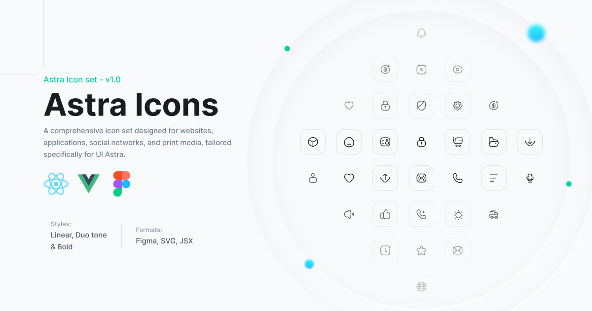

# Astra Icons

<p align="center">
  <a href="https://uiastra.com" target="_blank">
    <picture>
      <source media="(prefers-color-scheme: dark)" srcset=".github/dark.jpg">
      <source media="(prefers-color-scheme: light)" srcset=".github/light.jpg">
      
    </picture>
  </a>
</p>

## Getting Started

The easiest way to utilize these icons is to copy the SVG source from [uiastra.com](https://uiastra.com) and directly embed it into your HTML:

```html
<svg
  class="size-6 text-gray-500"
  fill="none"
  viewBox="0 0 24 24"
  stroke="currentColor"
  stroke-width="1.5"
>
  <rect x="2" y="2" width="20" height="20" rx="10" />
  <path
    d="M9 3C7.66667 8.84 7.66667 15.16 9 21"
    stroke-linecap="round"
    stroke-linejoin="round"
  />
  <path
    d="M15 3C16.3333 8.84 16.3333 15.16 15 21"
    stroke-linecap="round"
    stroke-linejoin="round"
  />
  <path d="M2 12L22 12" />
  <path d="M3 7L21 7" />
  <path d="M3 17L21 17" />
</svg>
```

These icons are designed to be easily styled by modifying the `color` CSS property, either directly or through utility classes such as `text-gray-500` in frameworks like [Tailwind CSS](https://tailwindcss.com).

## React Integration

Begin by installing `@astraicons/react` from npm:

```sh
npm install @astraicons/react
```

Then import each icon individually as a React component:

```js
import { GlobalIcon } from "@astraicons/react/linear";

function MyComponent() {
  return (
    <div>
      <GlobalIcon className="size-6 text-blue-500" />
      <p>...</p>
    </div>
  );
}
```

The 24x24 linear icons can be imported from `@astraicons/react/linear`, the 24x24 bold icons from `@astraicons/react/bold`, and the 24x24 brand icons from `@astraicons/react/brand`.

Icons are named using upper camel case and always end with `Icon`.

[View the full list of icon names on UNPKG &rarr;](https://unpkg.com/browse/@astraicons/react/linear/)

## Vue Integration

First, install `@astraicons/vue` from npm:

```sh
npm install @astraicons/vue
```

Next, import each icon individually as a Vue component:

```vue
<template>
  <div>
    <GlobalIcon class="size-6 text-blue-500" />
    <p>...</p>
  </div>
</template>

<script setup>
import { GlobalIcon } from "@astraicons/vue/linear";
</script>
```

The 24x24 linear icons can be imported from `@astraicons/vue/linear`, the 24x24 bold icons from `@astraicons/vue/bold`, and the 24x24 brand icons from `@astraicons/vue/brand`.

Icons follow an upper camel case naming convention and always end with `Icon`.

[View the full list of icon names on UNPKG &rarr;](https://unpkg.com/browse/@astraicons/vue/linear/)

## Contributing

While we welcome contributions to enhance the project, our current focus is on resolving issues like incorrect TypeScript types or improperly exported icons.

**Please note that we are not accepting contributions for new icons.**

## Credit

This project uses parts from the [HeroIcons](https://github.com/tailwindlabs/heroicons) library from [TailwindLabs](https://github.com/tailwindlabs).

## License

This library is released under the MIT license.
